# EcoBottle AR — Data Warehouse y Dashboard Comercial

Trabajo práctico final de **Introducción al Marketing Online y los Negocios Digitales**.
Autor: **Gaspi Alfonso** · Repositorio: <https://github.com/GaspiAlfonso/practica-imond> (fork de [AugustoCarmona/practica-imond](https://github.com/AugustoCarmona/practica-imond))

## 1. Objetivo

Diseñar e implementar un mini ecosistema de datos comercial (online + offline) para **EcoBottle AR**, que vende dos botellas reutilizables (Classic A y Sport B) en su tienda online y en 4 tiendas físicas (Buenos Aires, Córdoba, Santa Fe y Mendoza). El proyecto:

1. Modela un **esquema estrella** (Kimball) en SQL con DuckDB a partir de los 13 CSV de origen.
2. Calcula cada KPI con un **script Python** que lee el data warehouse.
3. Alimenta un **dashboard** para el área comercial con: Ventas, Usuarios Activos, Ticket Promedio, NPS, Ventas por Provincia y Ranking mensual por Producto.

**Resultado en una línea:** entre el 01/01/2024 y el 30/09/2025 la empresa vendió **$382.410.636** en **10.998** pedidos, con un ticket promedio de **$34.771** y un NPS de **30,0**.

## 2. Estructura del repositorio

```
raw/                  datos de origen (13 CSV, no se modifican)
sql/
  01_dimensiones.sql  dimensiones del modelo estrella
  02_hechos.sql       tablas de hechos con PK y FK
  03_consultas.sql    validaciones, KPIs y consultas de hallazgos
scripts/
  _common.py          conexión a dw/ y utilidades compartidas
  kpi_ventas.py                 KPI Ventas
  kpi_ticket_promedio.py        KPI Ticket Promedio
  kpi_usuarios_activos.py       KPI Usuarios Activos
  kpi_nps.py                    KPI NPS
  kpi_ventas_provincia.py       KPI Ventas por provincia
  kpi_ranking_producto.py       KPI Ranking mensual por producto
dw/                   data warehouse: CSV de dimensiones, hechos y KPIs (se regenera)
run_sql.py            ejecuta sql/ y arma el data warehouse
requirements.txt      dependencias (DuckDB)
```

## 3. Instrucciones de ejecución

**Requisitos:** Python 3.9 o superior y Git.

```bash
git clone https://github.com/GaspiAlfonso/practica-imond.git
cd practica-imond
python3 -m venv .venv
source .venv/bin/activate        # Windows: .venv\Scripts\activate
pip install -r requirements.txt
```

**Armar el data warehouse y calcular los KPIs** (en este orden):

```bash
python run_sql.py                       # crea las dimensiones y hechos y los exporta a dw/
python scripts/kpi_ventas.py
python scripts/kpi_ticket_promedio.py
python scripts/kpi_usuarios_activos.py
python scripts/kpi_nps.py
python scripts/kpi_ventas_provincia.py
python scripts/kpi_ranking_producto.py
```

> `run_sql.py` regenera `dw/` completo, y eso borra los CSV de KPIs. Cada vez que se ejecute, hay que volver a correr los 6 scripts.

Otros comandos útiles: `python run_sql.py --explorar` abre las tablas de origen en el navegador; `python run_sql.py --ui` arma el warehouse y lo abre para explorarlo.

**Resultado esperado de los scripts:** `kpi_ventas.py` imprime `Ventas totales: $382,410,636 | Pedidos: 10,998`.

## 4. Modelo estrella

Se modelaron **9 dimensiones** y **6 tablas de hechos**. Las tablas de hechos usan claves subrogadas hacia las dimensiones y llevan `PRIMARY KEY` y `FOREIGN KEY` (DuckDB rechaza la carga si una clave no existe). El diagrama completo, con columnas y claves, se genera solo en [`dw/modelo_estrella.md`](dw/modelo_estrella.md).

```mermaid
erDiagram
    dim_channel ||--o{ fact_nps : ""
    dim_channel ||--o{ fact_payment : ""
    dim_channel ||--o{ fact_sales_item : ""
    dim_channel ||--o{ fact_sales_order : ""
    dim_channel ||--o{ fact_shipment : ""
    dim_customer ||--o{ fact_nps : ""
    dim_customer ||--o{ fact_sales_item : ""
    dim_customer ||--o{ fact_sales_order : ""
    dim_customer ||--o{ fact_web_session : ""
    dim_date ||--o{ fact_nps : ""
    dim_date ||--o{ fact_payment : ""
    dim_date ||--o{ fact_sales_item : ""
    dim_date ||--o{ fact_sales_order : ""
    dim_date ||--o{ fact_shipment : ""
    dim_date ||--o{ fact_web_session : ""
    dim_order_status ||--o{ fact_sales_item : ""
    dim_order_status ||--o{ fact_sales_order : ""
    dim_payment_method ||--o{ fact_payment : ""
    dim_payment_method ||--o{ fact_sales_order : ""
    dim_product ||--o{ fact_sales_item : ""
    dim_province ||--o{ fact_sales_item : ""
    dim_province ||--o{ fact_sales_order : ""
    dim_province ||--o{ fact_shipment : ""
    dim_store ||--o{ fact_sales_item : ""
    dim_store ||--o{ fact_sales_order : ""
    dim_store ||--o{ fact_shipment : ""
    dim_traffic ||--o{ fact_web_session : ""
```



Decisiones de diseño:

- **Dos hechos de venta:** `fact_sales_order` (un pedido) para Ventas y Ticket, y `fact_sales_item` (una línea) para el ranking por producto. Así cada KPI se calcula al grano correcto y no se duplican importes.
- **Claves subrogadas** (`*_key`) en todas las dimensiones; el ID natural del origen se conserva como atributo.
- **Fila "Desconocido" (`-1`)** en `dim_customer` y `dim_store`: los pedidos online no tienen tienda y hay NPS y sesiones web anónimas. Así ninguna clave foránea queda en NULL.
- **Provincia desnormalizada en los hechos** (`province_key`), tomada de la dirección de envío, para filtrar y agrupar sin joins intermedios.
- **`dim_date` generada** con todos los días del período y atributos útiles (`year_month`, `is_weekend`).

## 5. Diccionario de datos

Convenciones: importes en **pesos argentinos (ARS)**; precios de lista **sin IVA**; fechas y horas en **hora de Argentina**. Las dimensiones llevan clave subrogada `*_key` (PK).

### 5.1 Dimensiones y hechos

#### `dim_date`

Un día (01/01/2024 al 30/09/2025).

| Columna | Tipo | Clave | Nulos | Descripción |
|---|---|---|---|---|
| `date_key` | INTEGER | PK | No | Clave de fecha `AAAAMMDD` (en hechos: fecha del pedido, de la sesión o de la respuesta). |
| `full_date` | DATE |  | No | Fecha calendario. |
| `year` | SMALLINT |  | No | Año. |
| `quarter` | SMALLINT |  | No | Trimestre (1-4). |
| `month` | SMALLINT |  | No | Mes (1-12). |
| `month_name` | VARCHAR |  | No | Nombre del mes en inglés. |
| `year_month` | VARCHAR |  | No | Año-mes `AAAA-MM`, útil para series mensuales. |
| `week_of_year` | SMALLINT |  | No | Semana del año. |
| `day` | SMALLINT |  | No | Día del mes. |
| `day_of_week` | SMALLINT |  | No | Día de la semana (1 = lunes ... 7 = domingo). |
| `day_name` | VARCHAR |  | No | Nombre del día en inglés. |
| `is_weekend` | BOOLEAN |  | No | `TRUE` si es sábado o domingo. |

#### `dim_channel`

Un canal de venta.

| Columna | Tipo | Clave | Nulos | Descripción |
|---|---|---|---|---|
| `channel_key` | INTEGER | PK | No | Clave subrogada del canal. |
| `channel_id` | INTEGER |  | No | ID natural del canal en el sistema de origen. |
| `code` | VARCHAR |  | No | Código del canal (`ONLINE`, `OFFLINE`). |
| `name` | VARCHAR |  | No | Nombre del canal. |

#### `dim_province`

Una provincia.

| Columna | Tipo | Clave | Nulos | Descripción |
|---|---|---|---|---|
| `province_key` | INTEGER | PK | No | Clave subrogada de la provincia (en hechos: provincia de la dirección de envío). |
| `province_id` | INTEGER |  | No | ID natural de la provincia. |
| `name` | VARCHAR |  | No | Nombre de la provincia. |
| `code` | VARCHAR |  | Sí | Código de la provincia (`BA`, `CBA`, `SF`, `MZA`). |

#### `dim_customer`

Un cliente, más la fila `-1` Desconocido.

| Columna | Tipo | Clave | Nulos | Descripción |
|---|---|---|---|---|
| `customer_key` | INTEGER | PK | No | Clave subrogada del cliente. `-1` = Desconocido / anónimo. |
| `customer_id` | INTEGER |  | Sí | ID natural del cliente (NULL en la fila Desconocido). |
| `email` | VARCHAR |  | Sí | Correo del cliente (único). |
| `first_name` | VARCHAR |  | Sí | Nombre. |
| `last_name` | VARCHAR |  | Sí | Apellido. |
| `full_name` | VARCHAR |  | No | Nombre y apellido. |
| `phone` | VARCHAR |  | Sí | Teléfono (opcional). |
| `status` | VARCHAR |  | No | Estado del cliente: `A` activo, `I` dado de baja (`N/A` en la fila Desconocido). |
| `status_name` | VARCHAR |  | No | Estado del cliente en texto. |
| `created_at` | TIMESTAMP |  | Sí | Fecha de alta del cliente. |

#### `dim_store`

Una tienda, más la fila `-1` para pedidos online.

| Columna | Tipo | Clave | Nulos | Descripción |
|---|---|---|---|---|
| `store_key` | INTEGER | PK | No | Clave subrogada de la tienda. `-1` = pedido online (sin tienda). |
| `store_id` | INTEGER |  | Sí | ID natural de la tienda. |
| `name` | VARCHAR |  | No | Nombre de la tienda. |
| `city` | VARCHAR |  | Sí | Ciudad de la tienda. |
| `province_name` | VARCHAR |  | Sí | Provincia de la tienda. |

#### `dim_payment_method`

Un método de pago.

| Columna | Tipo | Clave | Nulos | Descripción |
|---|---|---|---|---|
| `payment_method_key` | INTEGER | PK | No | Clave subrogada del método de pago. |
| `method` | VARCHAR |  | No | Método en origen (`CARD`, `CASH`, `TRANSFER`, `GATEWAY`). |
| `method_name` | VARCHAR |  | No | Método de pago en español. |

#### `dim_order_status`

Un estado de pedido.

| Columna | Tipo | Clave | Nulos | Descripción |
|---|---|---|---|---|
| `status_key` | INTEGER | PK | No | Clave subrogada del estado del pedido. |
| `status` | VARCHAR |  | No | Estado en origen (`CREATED`, `PAID`, `FULFILLED`, `CANCELLED`, `REFUNDED`). |
| `description` | VARCHAR |  | No | Significado del estado. |
| `is_sale` | BOOLEAN |  | No | `TRUE` si el pedido cuenta como venta (`PAID` o `FULFILLED`). |

#### `dim_product`

Un producto (con su categoría y familia aplanadas).

| Columna | Tipo | Clave | Nulos | Descripción |
|---|---|---|---|---|
| `product_key` | INTEGER | PK | No | Clave subrogada del producto. |
| `product_id` | INTEGER |  | No | ID natural del producto. |
| `sku` | VARCHAR |  | No | Código SKU (único). |
| `name` | VARCHAR |  | No | Nombre del producto. |
| `category` | VARCHAR |  | Sí | Categoría (Classic / Sport). |
| `family` | VARCHAR |  | Sí | Familia (Bottles), la categoría padre. |
| `list_price` | DECIMAL(12,2) |  | Sí | Precio de lista sin IVA (ARS). |

#### `dim_traffic`

Una combinación origen + dispositivo.

| Columna | Tipo | Clave | Nulos | Descripción |
|---|---|---|---|---|
| `traffic_key` | INTEGER | PK | No | Clave subrogada de origen + dispositivo. |
| `source` | VARCHAR |  | No | Origen de la visita (`ads`, `direct`, `referral`, `organic`). |
| `source_name` | VARCHAR |  | No | Origen en español. |
| `device` | VARCHAR |  | No | Dispositivo (`mobile`, `desktop`, `tablet`). |

#### `fact_sales_order`

**Grano: un pedido.** Fuente de Ventas, Ticket Promedio y Ventas por provincia.

| Columna | Tipo | Clave | Nulos | Descripción |
|---|---|---|---|---|
| `order_id` | BIGINT | PK | No | ID del pedido en origen (dimensión degenerada). |
| `date_key` | INTEGER | FK → `dim_date` | No | Fecha del pedido. |
| `customer_key` | INTEGER | FK → `dim_customer` | No | Clave subrogada del cliente. `-1` = Desconocido / anónimo. |
| `channel_key` | INTEGER | FK → `dim_channel` | No | Clave subrogada del canal. |
| `store_key` | INTEGER | FK → `dim_store` | No | Clave subrogada de la tienda. `-1` = pedido online (sin tienda). |
| `province_key` | INTEGER | FK → `dim_province` | No | Clave subrogada de la provincia (en hechos: provincia de la dirección de envío). |
| `payment_method_key` | INTEGER | FK → `dim_payment_method` | No | Clave subrogada del método de pago. |
| `status_key` | INTEGER | FK → `dim_order_status` | No | Clave subrogada del estado del pedido. |
| `order_timestamp` | TIMESTAMP |  | No | Fecha y hora del pedido (hora de Argentina). |
| `is_sale` | BOOLEAN |  | No | `TRUE` si el pedido cuenta como venta (`PAID` o `FULFILLED`). |
| `subtotal` | DECIMAL(12,2) |  | No | Suma de los `line_total` del pedido, sin IVA (ARS). |
| `tax_amount` | DECIMAL(12,2) |  | No | IVA, 21 % del subtotal (ARS). |
| `shipping_fee` | DECIMAL(12,2) |  | No | Costo de envío (ARS). |
| `total_amount` | DECIMAL(12,2) |  | No | `subtotal + IVA + envío` (ARS). Base de Ventas y Ticket Promedio. |

#### `fact_sales_item`

**Grano: un producto dentro de un pedido.** Fuente del ranking por producto.

| Columna | Tipo | Clave | Nulos | Descripción |
|---|---|---|---|---|
| `order_item_id` | BIGINT | PK | No | ID de la línea del pedido en origen. |
| `order_id` | BIGINT |  | No | ID del pedido en origen (dimensión degenerada). |
| `date_key` | INTEGER | FK → `dim_date` | No | Fecha del pedido. |
| `customer_key` | INTEGER | FK → `dim_customer` | No | Clave subrogada del cliente. `-1` = Desconocido / anónimo. |
| `channel_key` | INTEGER | FK → `dim_channel` | No | Clave subrogada del canal. |
| `store_key` | INTEGER | FK → `dim_store` | No | Clave subrogada de la tienda. `-1` = pedido online (sin tienda). |
| `province_key` | INTEGER | FK → `dim_province` | No | Clave subrogada de la provincia (en hechos: provincia de la dirección de envío). |
| `product_key` | INTEGER | FK → `dim_product` | No | Clave subrogada del producto. |
| `status_key` | INTEGER | FK → `dim_order_status` | No | Clave subrogada del estado del pedido. |
| `is_sale` | BOOLEAN |  | No | `TRUE` si el pedido cuenta como venta (`PAID` o `FULFILLED`). |
| `quantity` | INTEGER |  | No | Unidades (> 0). |
| `unit_price` | DECIMAL(12,2) |  | No | Precio unitario sin IVA (ARS). |
| `discount_amount` | DECIMAL(12,2) |  | No | Descuento de la línea (ARS). |
| `line_total` | DECIMAL(12,2) |  | No | `cantidad × precio − descuento` (ARS, sin IVA ni envío). Base del ranking por producto. |

#### `fact_payment`

**Grano: un pago** (uno por pedido). Permite conciliar ventas y cobros.

| Columna | Tipo | Clave | Nulos | Descripción |
|---|---|---|---|---|
| `payment_id` | BIGINT | PK | No | ID del pago en origen. |
| `order_id` | BIGINT |  | No | ID del pedido en origen (dimensión degenerada). |
| `date_key` | INTEGER | FK → `dim_date` | No | Fecha del pedido. |
| `paid_date_key` | INTEGER | FK → `dim_date` | Sí | Fecha de cobro (NULL si no se cobró). |
| `channel_key` | INTEGER | FK → `dim_channel` | No | Clave subrogada del canal. |
| `payment_method_key` | INTEGER | FK → `dim_payment_method` | No | Clave subrogada del método de pago. |
| `status` | VARCHAR |  | No | Estado del pago (`PENDING`, `PAID`, `FAILED`, `REFUNDED`). |
| `amount` | DECIMAL(12,2) |  | No | Monto del pago (ARS). |
| `paid_at` | TIMESTAMP |  | Sí | Fecha y hora del cobro (NULL si no se concretó). |
| `transaction_ref` | VARCHAR |  | Sí | Referencia de la transacción (opcional). |

#### `fact_shipment`

**Grano: un envío por correo.** Fuente de tiempos de entrega.

| Columna | Tipo | Clave | Nulos | Descripción |
|---|---|---|---|---|
| `shipment_id` | BIGINT | PK | No | ID del envío en origen. |
| `order_id` | BIGINT |  | No | ID del pedido en origen (dimensión degenerada). |
| `date_key` | INTEGER | FK → `dim_date` | No | Fecha del pedido. |
| `shipped_date_key` | INTEGER | FK → `dim_date` | Sí | Fecha de despacho. |
| `delivered_date_key` | INTEGER | FK → `dim_date` | Sí | Fecha de entrega. |
| `channel_key` | INTEGER | FK → `dim_channel` | No | Clave subrogada del canal. |
| `store_key` | INTEGER | FK → `dim_store` | No | Clave subrogada de la tienda. `-1` = pedido online (sin tienda). |
| `province_key` | INTEGER | FK → `dim_province` | No | Clave subrogada de la provincia (en hechos: provincia de la dirección de envío). |
| `carrier` | VARCHAR |  | Sí | Correo que realiza el envío. |
| `tracking_number` | VARCHAR |  | Sí | Número de seguimiento. |
| `status` | VARCHAR |  | No | Estado del envío (`READY`, `SHIPPED`, `DELIVERED`, `CANCELLED`). |
| `shipped_at` | TIMESTAMP |  | Sí | Fecha y hora de despacho. |
| `delivered_at` | TIMESTAMP |  | Sí | Fecha y hora de entrega. |
| `delivery_days` | DOUBLE |  | Sí | Días entre despacho y entrega (NULL si no se entregó). |

#### `fact_web_session`

**Grano: una sesión web.** Fuente de Usuarios Activos.

| Columna | Tipo | Clave | Nulos | Descripción |
|---|---|---|---|---|
| `session_id` | BIGINT | PK | No | ID de la sesión web. |
| `date_key` | INTEGER | FK → `dim_date` | No | Fecha de inicio de la sesión. |
| `customer_key` | INTEGER | FK → `dim_customer` | No | Clave subrogada del cliente. `-1` = Desconocido / anónimo. |
| `traffic_key` | INTEGER | FK → `dim_traffic` | No | Clave subrogada de origen + dispositivo. |
| `active_user_key` | VARCHAR |  | No | Identifica al usuario activo: `C<id>` si inició sesión, `S<id sesión>` si es anónimo. |
| `is_logged_in` | BOOLEAN |  | No | `TRUE` si la sesión tiene cliente identificado. |
| `started_at` | TIMESTAMP |  | No | Inicio de la sesión. |
| `ended_at` | TIMESTAMP |  | Sí | Fin de la sesión (opcional). |
| `duration_seconds` | INTEGER |  | Sí | Duración en segundos. |

#### `fact_nps`

**Grano: una respuesta de la encuesta NPS.** Fuente del NPS.

| Columna | Tipo | Clave | Nulos | Descripción |
|---|---|---|---|---|
| `nps_id` | BIGINT | PK | No | ID de la respuesta NPS. |
| `date_key` | INTEGER | FK → `dim_date` | No | Fecha de la respuesta. |
| `customer_key` | INTEGER | FK → `dim_customer` | No | Clave subrogada del cliente. `-1` = Desconocido / anónimo. |
| `channel_key` | INTEGER | FK → `dim_channel` | No | Clave subrogada del canal. |
| `score` | SMALLINT |  | No | Puntaje 0-10. |
| `nps_category` | VARCHAR |  | No | `PROMOTER` (9-10), `PASSIVE` (7-8) o `DETRACTOR` (0-6). |
| `comment` | VARCHAR |  | Sí | Comentario libre (opcional). |
| `responded_at` | TIMESTAMP |  | No | Fecha y hora de la respuesta. |


### 5.2 Tablas de KPIs (generadas por `scripts/`)

| Archivo en `dw/` | Script | Columnas |
|---|---|---|
| `kpi_ventas_diario.csv` | `kpi_ventas.py` | `fecha`, `mes`, `canal`, `provincia`, `pedidos`, `ventas` |
| `kpi_ticket_mensual.csv` | `kpi_ticket_promedio.py` | `mes`, `canal`, `provincia`, `pedidos`, `ventas`, `ticket_promedio` |
| `kpi_usuarios_activos_diario.csv` y `_mensual.csv` | `kpi_usuarios_activos.py` | `periodo`, `origen`, `usuarios_activos`, `sesiones` |
| `kpi_nps_diario.csv` y `_mensual.csv` | `kpi_nps.py` | `periodo`, `canal`, `respuestas`, `promotores`, `pasivos`, `detractores`, `nps` |
| `kpi_ventas_provincia.csv` | `kpi_ventas_provincia.py` | `mes`, `canal`, `provincia`, `cod_provincia`, `pedidos`, `ventas` |
| `kpi_ranking_producto_mensual.csv` | `kpi_ranking_producto.py` | `mes`, `canal`, `provincia`, `producto`, `categoria`, `unidades`, `ventas_items`, `ranking_mes` |

### 5.3 Dominios de los estados

| Campo | Valores |
|---|---|
| Pedido (`dim_order_status.status`) | `CREATED` (sin pagar), `PAID`, `FULFILLED`, `CANCELLED`, `REFUNDED`. **Cuentan como venta:** `PAID` y `FULFILLED`. |
| Pago (`fact_payment.status`) | `PENDING`, `PAID`, `FAILED`, `REFUNDED` |
| Envío (`fact_shipment.status`) | `READY`, `SHIPPED`, `DELIVERED`, `CANCELLED` |
| Cliente (`dim_customer.status`) | `A` activo, `I` dado de baja |
| Método de pago | `CARD`, `CASH`, `TRANSFER`, `GATEWAY` |
| Origen de visita | `ads`, `direct`, `referral`, `organic` |

## 6. Supuestos

1. **Venta** = pedido en estado `PAID` o `FULFILLED`. `CREATED`, `CANCELLED` y `REFUNDED` no cuentan.
2. **Ventas y Ticket Promedio** usan `total_amount` (incluye IVA 21 % y envío), como indica la consigna. El **ranking por producto** usa `line_total` (sin IVA ni envío), por eso la suma de los productos es menor que las Ventas totales.
3. **Ticket Promedio** = `SUM(total_amount) / cantidad de pedidos`, con el mismo filtro de Ventas.
4. **Provincia** = provincia de la dirección de envío. En compras en tienda es la provincia de la tienda.
5. **Usuarios activos:** un usuario es el cliente si inició sesión; si la sesión es anónima, cada sesión cuenta como un usuario (el 70,5 % de las sesiones es anónimo). Una persona anónima que vuelve se cuenta de nuevo, porque no hay forma de reconocerla. Por eso es una **estimación**.
6. **Los usuarios distintos no se suman** entre períodos ni entre orígenes. Por eso el dashboard los calcula con `COUNT_DISTINCT` sobre `fact_web_session.csv`. Los CSV de usuarios activos por período (`kpi_usuarios_activos_*.csv`) traen además una fila `origen = 'Todos'` con el total real de cada período.
7. **NPS** = (% de respuestas 9-10) − (% de respuestas 0-6), por 100. Las respuestas sin cliente se incluyen (anónimas). El dashboard recalcula el NPS con los conteos de cada filtro; los CSV de NPS traen además filas `canal = 'Todos'` que el tablero excluye para no duplicar respuestas.
8. **Las sesiones web no tienen número de pedido** y el NPS tampoco: no se puede atribuir una venta a un origen de tráfico ni un NPS a un pedido. El NPS se relaciona por cliente y canal.
9. **Las sesiones web pertenecen al canal online;** no tienen provincia. Por eso Usuarios Activos no responde a los filtros de canal y provincia.
10. Los datos son una **foto del 30/09/2025 23:59:59**; 2025 tiene 9 meses, por lo que las comparaciones interanuales usan enero-septiembre.
11. Los datos de `raw/` son sintéticos y no se modificaron. Las cuentas cierran: `subtotal` = suma de `line_total` y `total_amount` = subtotal + IVA + envío (se verifica en `sql/03_consultas.sql`).

## 7. KPIs y consultas clave

| KPI | Definición |
|---|---|
| Ventas | `SUM(total_amount)` de pedidos `PAID` y `FULFILLED`, por período, canal, provincia y producto |
| Ticket Promedio | `SUM(total_amount) / COUNT(pedidos)` con el mismo filtro |
| Usuarios Activos | `COUNT(DISTINCT active_user_key)` de sesiones web por período |
| NPS | `(%promotores − %detractores) × 100` sobre las respuestas |
| Ventas por Provincia | `SUM(total_amount)` agrupado por provincia de envío |
| Ranking por Producto | `SUM(line_total)` por producto y mes, ordenado de mayor a menor |

Las consultas completas (validaciones, KPIs y hallazgos) están en [`sql/03_consultas.sql`](sql/03_consultas.sql). Estas son las principales:

```sql
-- B1. Ventas totales ($) y pedidos — solo PAID y FULFILLED
SELECT SUM(total_amount) AS ventas_totales, COUNT(*) AS pedidos
FROM fact_sales_order
WHERE is_sale;

-- B3. Ticket promedio = ventas / pedidos, por canal
SELECT ch.name AS canal, SUM(o.total_amount) / COUNT(*) AS ticket_promedio
FROM fact_sales_order AS o
JOIN dim_channel AS ch USING (channel_key)
WHERE o.is_sale
GROUP BY ch.name
ORDER BY canal;

-- B4. Usuarios activos por mes (cliente logueado, o sesión si es anónimo)
SELECT d.year_month AS mes,
       COUNT(DISTINCT w.active_user_key) AS usuarios_activos,
       COUNT(DISTINCT w.customer_key) FILTER (WHERE w.is_logged_in) AS clientes_logueados,
       COUNT(*) AS sesiones
FROM fact_web_session AS w
JOIN dim_date AS d USING (date_key)
GROUP BY d.year_month
ORDER BY mes;

-- B5. NPS por mes = (%promotores - %detractores) * 100
SELECT d.year_month AS mes,
       COUNT(*) AS respuestas,
       ROUND((COUNT(*) FILTER (WHERE n.nps_category = 'PROMOTER')
            - COUNT(*) FILTER (WHERE n.nps_category = 'DETRACTOR')) * 100.0 / COUNT(*), 1) AS nps
FROM fact_nps AS n
JOIN dim_date AS d USING (date_key)
GROUP BY d.year_month
ORDER BY mes;

-- B7. Ventas por provincia (provincia de la dirección de envío)
SELECT p.name AS provincia, SUM(o.total_amount) AS ventas, COUNT(*) AS pedidos
FROM fact_sales_order AS o
JOIN dim_province AS p USING (province_key)
WHERE o.is_sale
GROUP BY p.name
ORDER BY ventas DESC;

-- B8. Ranking mensual por producto (line_total: sin IVA ni envío)
SELECT d.year_month AS mes,
       p.name AS producto,
       SUM(i.line_total) AS ventas_items,
       RANK() OVER (PARTITION BY d.year_month ORDER BY SUM(i.line_total) DESC) AS ranking
FROM fact_sales_item AS i
JOIN dim_date    AS d USING (date_key)
JOIN dim_product AS p USING (product_key)
WHERE i.is_sale
GROUP BY d.year_month, p.name
ORDER BY mes, ranking;
```

### Validaciones

`sql/03_consultas.sql` comprueba que el warehouse sea consistente con el origen:

| Chequeo | Resultado |
|---|---|
| Filas de cada hecho vs. su tabla de `raw/` | Coinciden |
| Diferencia de importes (`total_amount` y `line_total`) | 0 |
| Pedidos donde el subtotal o el total no cierran | 0 |
| Ventas totales | $382.410.636 con 10.998 pedidos |

## 8. Dashboard

> ⚠️ **COMPLETAR:** enlace al tablero publicado y capturas.

- **Enlace al dashboard:** `COMPLETAR`
- **Herramienta:** `COMPLETAR (Looker Studio / Power BI)`
- **Fuente de datos:** los CSV de `dw/` (`kpi_*.csv` y las dimensiones y hechos necesarios).
- **Capturas:** `COMPLETAR` (por ejemplo en una carpeta `docs/`).

**Filtros:** fecha, canal, provincia y producto. Cada filtro actúa sobre las vistas cuyos datos tienen ese campo:

| Vista | Fuente en `dw/` | Cálculo en el tablero | Filtros que aplican |
|---|---|---|---|
| Ventas (serie temporal y tarjeta en $M) | `kpi_ventas_diario.csv` | `SUM(ventas)` | fecha, canal, provincia |
| Ticket promedio (en $K) | `kpi_ventas_diario.csv` | `SUM(ventas) / SUM(pedidos)` | fecha, canal, provincia |
| Ventas por provincia (mapa o barras) | `kpi_ventas_diario.csv` | `SUM(ventas)` por provincia | fecha, canal |
| Usuarios activos (serie y tarjeta en miles) | `fact_web_session.csv` | `COUNT_DISTINCT(active_user_key)` | fecha |
| NPS (tarjeta y tendencia) | `kpi_nps_diario.csv` | `(SUM(promotores) − SUM(detractores)) / SUM(respuestas) × 100`, excluyendo las filas `canal = 'Todos'` | fecha, canal |
| Ranking mensual por producto (top N) | `kpi_ranking_producto_mensual.csv` | `SUM(ventas_items)` por producto, ordenado | fecha (por mes), canal, provincia, producto |

Los usuarios activos se calculan directamente sobre las sesiones (`fact_web_session.csv`) porque los usuarios distintos no se pueden sumar: así el tablero cuenta correctamente para cualquier rango de fechas. El filtro de producto solo afecta al ranking, y las sesiones web no tienen canal ni provincia (ver supuestos 8 y 9).

## 9. Hallazgos

1. **El crecimiento viene del canal online.** En enero-septiembre, las ventas pasaron de $146,3 M (2024) a $170,6 M (2025), un **16,6 %** más. Online creció **29,7 %** ($81,2 M → $105,3 M) y las tiendas físicas quedaron prácticamente planas (**0,3 %**, $65,1 M → $65,3 M). El canal online concentra el **59,4 %** de las ventas del período ($227,0 M online contra $155,4 M en tiendas).
2. **Diciembre de 2024 fue el pico:** $28,4 M de ventas contra un promedio mensual de $18,2 M, y 5.885 usuarios activos contra un promedio de 4.140.
3. **Una demora logística coincide con la caída del NPS online.** En julio y agosto de 2024 el tiempo de entrega pasó de unos **3,5 días** a **7,9 y 8,1 días**. El NPS online cayó de 29,2 (junio) a **-6,0** (julio) y **-26,5** (agosto), y se recuperó a 31,9 en octubre. El NPS de las tiendas físicas no se movió (38,3 y 46,2). Es una asociación temporal: los datos no prueban por sí solos que la demora sea la causa.
4. **El canal online pierde más pedidos.** Se cancela el **8,3 %** de los pedidos online contra el **1,2 %** en tiendas. Dentro del online, la pasarela de pago (Mercado Pago) cancela el **11,1 %** y la tarjeta el **6,2 %**. Además, **565** pagos fallaron (4,7 % del total).
5. **Buenos Aires lidera en volumen, no en ticket.** Concentra el **37,3 %** de las ventas (Córdoba 23,4 %, Santa Fe 22,9 %, Mendoza 16,4 %), pero el ticket es parecido en las cuatro provincias (entre $34.423 y $35.165). Buenos Aires también entrega más rápido: **2,8 días** contra 4,5-4,8 días en el resto.
6. **Sport B factura más con menos unidades.** Vende $162,7 M en ítems contra $147,2 M de Classic A (un 10,6 % más) con 11.047 unidades contra 12.498, por su precio de lista más alto. Sport B fue el producto n.º 1 en 12 de 21 meses y Classic A en 9.
7. **El cliente vuelve a comprar:** el **71 %** de los 3.194 clientes con compras realizó dos o más.
8. **Tráfico:** el **61,9 %** de las sesiones es desde celular, y la conversión aproximada de la tienda online (pedidos online que son venta sobre sesiones totales) es de **6,4 %**. Es una aproximación, porque las sesiones no se pueden vincular a pedidos.
9. **Las ventas del fin de semana** representan el 25,8 % del total.

### Ideas para ampliar el dashboard

- Vista de **logística**: tiempo de entrega por mes y provincia junto al NPS online, para detectar demoras antes de que afecten la satisfacción.
- **Tasa de cancelación** y pagos fallidos por método de pago.
- **Conversión** mensual (sesiones contra pedidos) y mix de tráfico por origen y dispositivo.
- **Clientes recurrentes** y frecuencia de compra.
- Comparación **interanual** (mismo mes, año contra año) y variación contra el mes anterior en las tarjetas.

## 10. Buenas prácticas aplicadas

- **Entorno virtual** (`.venv`) y `requirements.txt` con la versión fijada de DuckDB.
- **Conventional commits** (`feat(sql): ...`, `feat(scripts): ...`, `chore(dw): ...`, `docs: ...`).
- **Trabajo en una rama** (`feat/dw-star-model`) unida a `main`, con toda la gestión del repositorio desde la consola.
- **Datos de origen intactos** (`raw/`) y warehouse reproducible: `warehouse.duckdb` no se versiona; se recrea con `python run_sql.py`.
- **Validaciones automáticas** en SQL para comprobar que el modelo es consistente con el origen.
